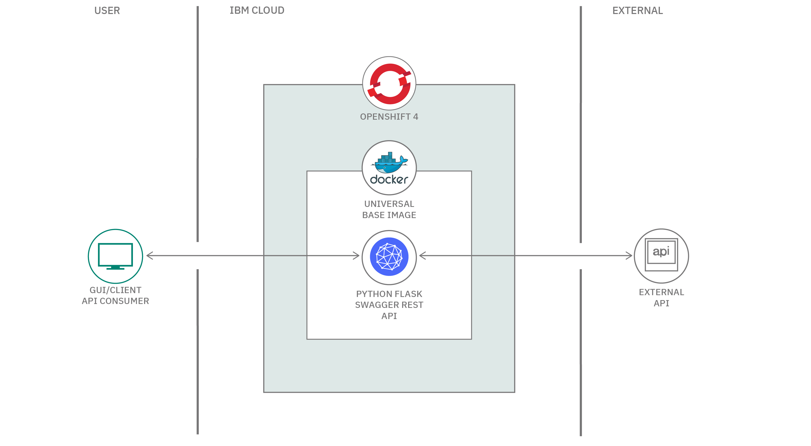
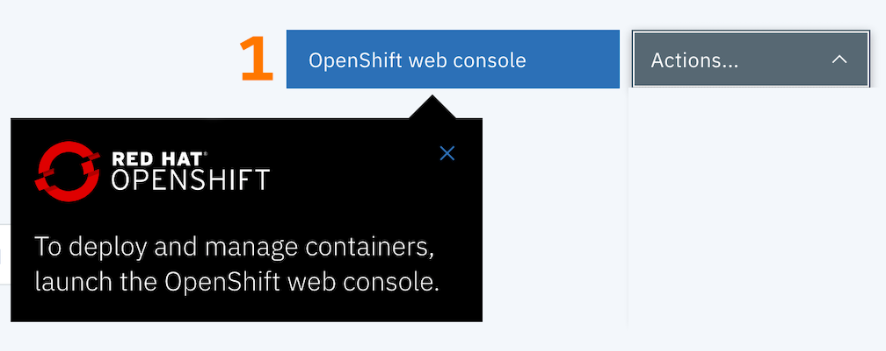
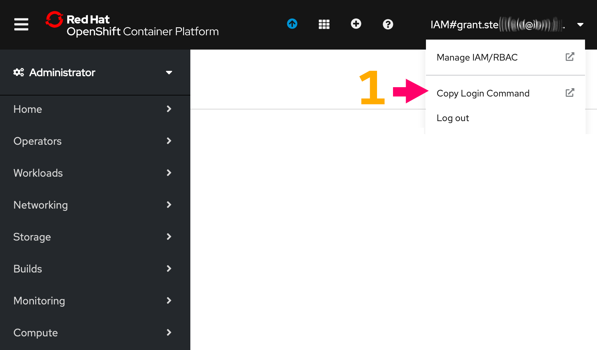
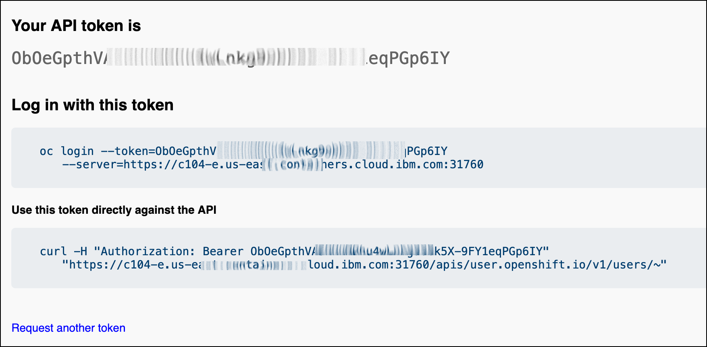
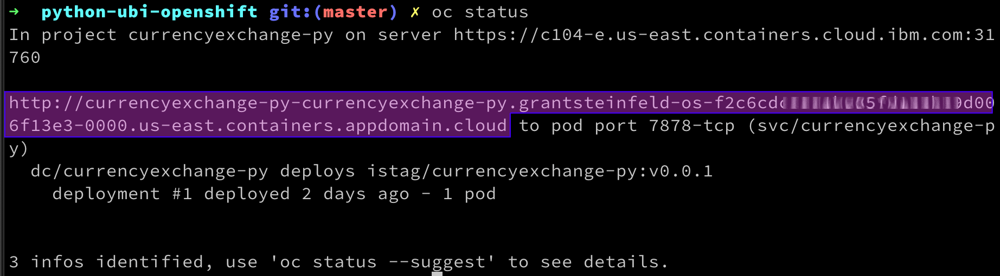

[](https://travis-ci.com/IBM/python-ubi-openshift)

#  Deploy an application to OpenShift 4 using Red Hat Universal Base Image (UBI)

This code pattern is part of the [Bee Travels project](https://github.com/bee-travels) that focuses on deploying a Python currency exchange application to OpenShift 4 using UBI


## After following this code pattern, you will understand how to:

* Design and create a Python microservice with a REST interface that has a swagger test harness where you can manually inspect, discover, and run the various API endpoints.

* Build a docker image of this microservice using the UBI
* Deploy and run this microservice on OpenShift version 4

## Architecture

This is the flow of the currency conversion microservice.



***Figure 1: Architecture flow***

1. Client API Consumer calls the microservice over the internet (http(s) request).
1. Flask process acts as a `web server` and accepts the REST request (e.g. GET /convertCurrency/ZAR/USD/600.66).
1. Code routing in Flask passes the request to a service module which in turn calls the External European Currency Exchange API (http://api.exchangeratesapi.io).
1. An exchange rate for ZAR is retrieved and stored. The value of 600.66 South African Rands (ZAR) is converted to US Dollars(USD).
1. Flask then sends a response to the calling consumer with the dollar amount (in this case, $40.59 ).


## Included components

* [IBM Cloud RedHat OpenShift version 4](https://www.ibm.com/cloud/openshift): Red Hat® OpenShift® on IBM Cloud™ is a fully managed OpenShift service that leverages the enterprise scale and security of the IBM Cloud.
* [Swagger](https://swagger.io/): A framework of API developer tools for the OpenAPI Specification that enables development across the entire API lifecycle.


## Featured technologies

* [Container Orchestration](https://www.ibm.com/cloud/container-service/) is the process of automating the deployment, scaling and management of containerized applications.

* [Microservices](https://www.ibm.com/cloud/architecture/architectures/microservices/) are an application architectural style in which an application is composed of many discrete, network-connected components called microservices.  They are collections of fine-grained, loosely coupled services intercommunicating via a lightweight protocol to provide building blocks in modern application composition in the cloud.

* [Python](https://www.python.org/) is a programming language that lets you work quickly and integrate systems more effectively.

* [Flask](https://flask.palletsprojects.com/en/1.1.x/) is a [microframework](https://en.wikipedia.org/wiki/Flask_(web_framework)) written in Python. It is classified as a microframework because it does not require particular tools or libraries.

# Prerequisites
You need to have the following installed to complete the steps in this code pattern:

* [Docker](https://www.docker.com/products/docker-desktop)
* [IBM Cloud Account](https://cloud.ibm.com/registration)
* [IBM RedHat OpenShift 4.3 Cluster](https://cloud.ibm.com/kubernetes/catalog/openshiftcluster)
* OpenShift CLI tool [oc](https://cloud.ibm.com/docs/openshift?topic=openshift-openshift-cli#cli_oc)

# Steps 

Follow these steps to set up and run this code pattern locally and on the cloud. The steps are described in detail below.

1. [Clone the GitHub repository locally](#1-clone-the-GitHub-repository-locally)

2. [Build a docker image and run it locally](#2-build-and-run-a-docker-image-locally)

3. [Deploy to IBM RedHat OpenShift 4 Cluster](#3-deploy-to-openshift-4-cluster)

### 1. Clone the GitHub repository locally

Clone the `currencyexchange` GitHub repository locally.

In a terminal, run the following:

```bash
git clone https://github.com/IBM/python-ubi-openshift.git

cd python-ubi-openshift
```


### 2. Build and run a docker image locally

We showcase this method, by using the UBI.

## What is UBI?

### Introducing UBI

At the core of containers there is a lighter weight Linux operating system. Most of us may have used Ubuntu or Alpine as the base Operating system.

Red Hat now offers us a good alternative base image, that is essentially the core
of Red Hat Enterprise Linux.  Much like CentOS and Red Hat Enteprise linux derive it's core elements from the OpenSource Fedora project.

This ***Linux alternative from Red Hat*** is called the Red Hat Universal Base Image (UBI).

The UBI comes in a few flavors:

1.  You can choose one of the three base images (`ubi`, `ubi-minimal` and `ubi-init`)
1.  Or language-specific runtime images (e.g. `node.js`, `python`, etc.)

UBI allows one to use associated packages provided by `YUM repositories` which satisfy common application dependencies, like `httpd` (apache web server) etc.


### Take a look at our [Dockerfile](./Dockerfile) and notice the `FROM` directive is using the UBI version 8 (core of Red Hat 8) base image.

```yaml
FROM registry.access.redhat.com/ubi8/ubi
```

Now let's build this docker image with the `UBI`.


1. Make sure you are at the root directory of this application.

1. Note your docker-hub username
<details><summary><strong>How to find your docker hub credentials</strong></summary>

> To download Docker Desktop you must create a Docker Hub account.

> To find the username, you can click on at your Docker Desktop icon (Mac) toolbar 


</details>

1. Build the docker image by running:

```bash
export DOCKERHUB_USERNAME=<your-dockerhub-username>
docker build -t $DOCKERHUB_USERNAME/currencyexchange-py:v0.0.1 .
```

<details><summary><strong>Expected output details</strong></summary>

Here is a truncated snippet of the successful output you should see:

```bash
Sending build context to Docker daemon  69.63MB
Step 1/10 : FROM registry.access.redhat.com/ubi8/ubi
 ---> fd73e6738a95

 ...

Collecting flask (from -r requirements.txt (line 13))
  Downloading https://files.pythonhosted.org/packages/9b/93/628509b8d5dc749656a9641f4caf13540e2cdec85276964ff8f43bbb1d3b/Flask-1.1.1-py2.py3-none-any.whl (94kB)

 ...

Successfully built 3b5631170697
Successfully tagged <DOCKERHUB_USERNAME>/currencyexchange-py:v0.0.1
```

Notes:

* The docker build process, pulled the RedHat 8 Universal Base Image from the redhat registry.

* The base image is the generic image, i.e. ubi8/ubi.  We could have use the Python 3 language specic flavor of the image but opted for this version for 2 reasons:

1. to show off the yum install features

1. to show how a finer controlled version of the language could have been used, like in our case the latest version (at the time of writing) of Python version 3.8 (note to check docker file version to be sure!)


</details>

Great! So, now lets run the image locally!

```bash
docker run -p 7878:7878 $DOCKERHUB_USERNAME/currencyexchange-py:v0.0.1
```

At your command line run: `docker ps` and you should now confirm that the docker container for the currencyexchange microservice is up and running.


> Explore the microservice from your browser at
> [http://127.0.0.1:7878](http://127.0.0.1:7878) for documentation about this API's endpoints and a `try-it-out` test harness to actually run the API calls.


### 3. Deploy to OpenShift 4 cluster

1. To allow changes to the this microservice, create a repo on [Docker Cloud](https://cloud.docker.com/) where you can push the newly modified container. 


```bash
# build your docker image
export DOCKERHUB_USERNAME=<your-dockerhub-username>

docker build -t $DOCKERHUB_USERNAME/currencyexchange-py:v0.0.1 .

docker login

# push image to docker hub
docker push $DOCKERHUB_USERNAME/currencyexchange-py:v0.0.1

```
<details><summary><strong>What a successful push to docker hub should look like</strong></summary>

```bash
The push refers to repository [docker.io/claraxxxxxx/currencyexchange-py]
693f7ba0eeed: Pushed 
225cfc6f0260: Pushed 
2ddc888e45c8: Pushed 
1aac3cbf59e3: Pushed 
85f69e555a1b: Pushed 
1295eae54c9d: Pushed 
v0.0.1: digest: sha256:2aa41155a8bd44bb25tytytyt990ed4d5f455968ef88697463456f249a35654841d size: 1574
```
</details>


2. Provision an [IBM RedHat OpenShift 4 Service](https://cloud.ibm.com/kubernetes/catalog/openshiftcluster)
and follow the set of instructions for creating a Container and Cluster.

### Deploy the Python microservice image to OpenShift.

You can deploy to OpenShift by either the Web Console browser applicaton, or by using the command line terminal. 

We are going to use the `oc` command line tool in this code pattern. Please check that you have v4.1.0 or later installed.


<details><summary><strong>
Install or verify the oc tool
</strong></summary>
 Run the command below

```bash

#aserctain what version of the oc cli you have installed
oc version

#You should have v4.1 or later installed.
v4.1.0

If you don't already have this installed, please follow instructions to do so here: [`oc` CLI documentation](https://cloud.ibm.com/docs/openshift?topic=openshift-openshift-cli#cli_oc) 

```
</details>

<br/>


### Login to your OpenShift 4 cluster



Launch the `Web Console` by clicking on the blue and white button ( annotated with a number(1) above )

Once in the OpenShift Web Console screen, click on your username and choose 



Click on the `Copy login command` dropdown option under your username



By clicking on display token hyperlink will reveal your oc login token and command.


use `oc login ... ` to login to your cluster, for example 
```sh
oc login --token=X8bjO-ROAhGUx8S9pvg6767574ysuG9SSgSI6hyg --server=https://c108-e.us-northwest.containers.cloud.ibm.com:31007
```

create a new project

```bash
oc new-project currencyexchange-py
```

you should be able to confirm this by typing:

```bash
oc project
```
and see


next add a new application

```bash
oc new-app $DOCKERHUB_USERNAME/currencyexchange-py:v0.0.1
```

Great!  Now you should see


Note the yellow highlight section confirms that the RedHat UBI is the base image in your docker deployment.

Almost there!  You will need to expose the microservice to the outside world by executing

```bash
oc expose svc/currencyexchange-py

#expected output
> route.route.openshift.io/currencyexchange-py exposed

#get the external URL to access the microservice
oc status

```
You should see `oc status` commands output similar to this



Now the route is exposed externally and will be visible via the public internet.

### Accessing the microservice over the world wide web

You can now access the currency exchange microservice running inside your OpenShift cluster by navigating to URL, ( see the figure above, where the URL is highlighted in purple).

You should now see the Flask generated swagger RESTful API as an interactive test harness in a web page, where you can explore and manually test the Currency Conversion microservice:


### Performance and health monitoring of your microserive 

You can examine the `health` of your microsevice with the `OpenShift Web Console Dashboard` 


Here you can monitor your `currency exchange microservice` cluster.  See and adust the number of pods, the more pods the more resiliant and responsize your microservice will behave under load.  You can also see the Bandwidth, Memory, CPU and disk utilization.


### Congratulations!  

You have now successfully created a Python Flask microservice container image, using the UBI, and optionally deployed it to a Red Hat OpenShift 4 cluster on the IBM Cloud.


# Resources
[Introducing the Red Hat Universal Base Image ](https://www.redhat.com/en/blog/introducing-red-hat-universal-base-image) - RedHat blog by Scott McCarty


[Python RESTful APIs using flask-restplus](https://pypi.org/project/flask-restplus/)


## License

This code pattern is licensed under the Apache License, Version 2. Separate third-party code objects invoked within this code pattern are licensed by their respective providers pursuant to their own separate licenses. Contributions are subject to the [Developer Certificate of Origin, Version 1.1](https://developercertificate.org/) and the [Apache License, Version 2](https://www.apache.org/licenses/LICENSE-2.0.txt).

[Apache License FAQ](https://www.apache.org/foundation/license-faq.html#WhatDoesItMEAN)

