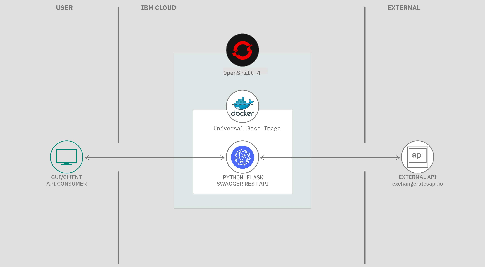
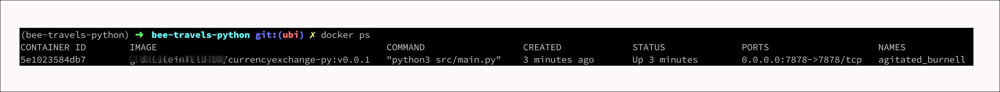
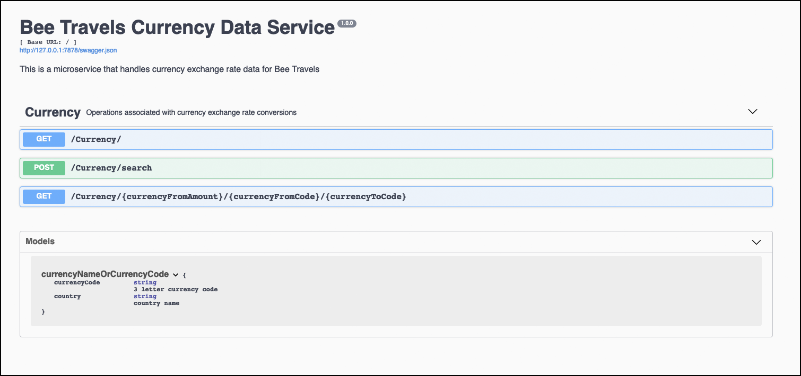
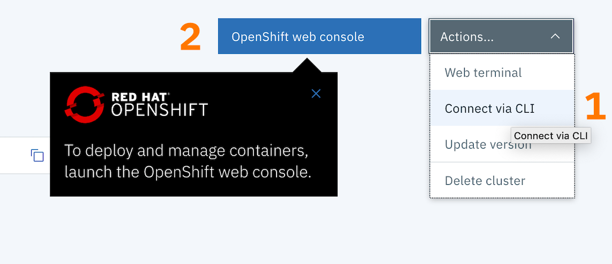
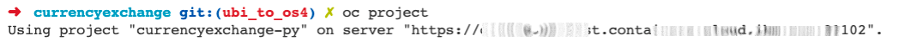
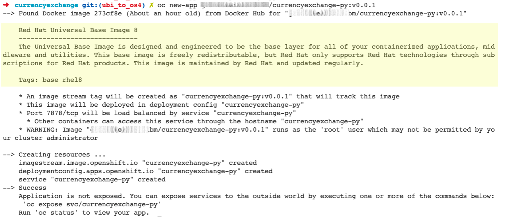
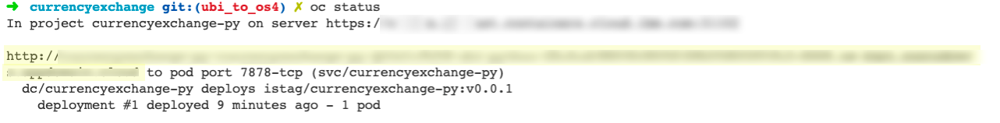
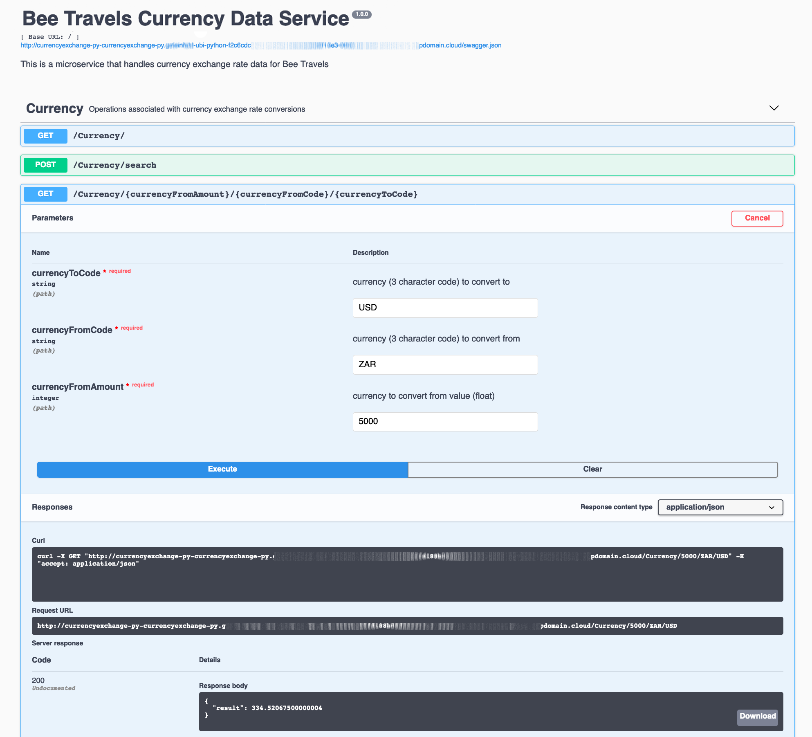
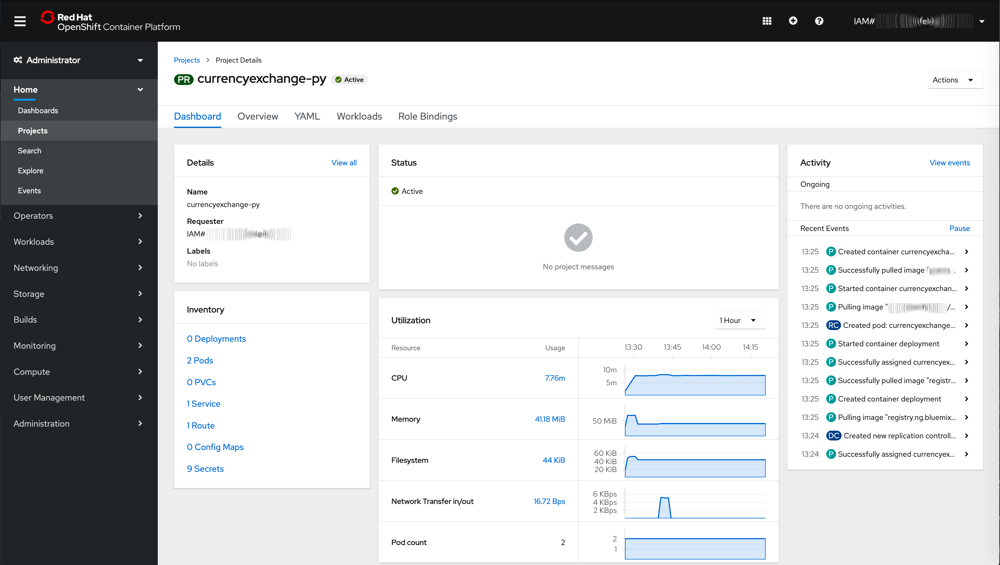

#  Deploy an application to Openshift 4 using Redhat's universal base image

This code pattern is part of the Bee Travels project that focuses on deploying a python currency exchange application to Openshift 4 using Redhat's universal base image


## After following this code pattern, you will understand how to:

* Design and create a Python microservice with a REST interface that has a swagger test harness where you can manually inspect, discover, and run the various API endpoints.
* Use and run this simple microservice.
* Build a docker image of this microservice using the RedHat Universal Base Image(UBI)
* Deploy and run this microservice on OpenShift version 4

## Architecture

This flow is for the runtime of the currency conversion microservice.




***Figure 1. Production flow***

1. Client API Consumer calls the microservice over the internet (http/s request).
1. Flask process acts as a `web server` and accepts the REST request (e.g. GET /convertCurrency/ZAR/USD/600.66).
1. Code routing in Flask passes the request to a service module which in turn calls the External European Currency Exchange API (http://api.exchangeratesapi.io).
1. An exchange rate for ZAR is retrieved and stored. The value of 600.66 South African Rands (ZAR) is converted to US Dollars(USD).
1. Flask then sends a response to the calling consumer with the dollar amount (in this case, $40.59 ).

## Included components

* [IBM Cloud RedHat Openshift version 4](https://www.ibm.com/cloud/openshift): Red Hat® OpenShift® on IBM Cloud™ is a fully managed OpenShift service that leverages the enterprise scale and security of IBM Cloud.
* [Swagger](https://swagger.io/): A framework of API developer tools for the OpenAPI Specification that enables development across the entire API lifecycle.


## Featured technologies

* [Container Orchestration](https://www.ibm.com/cloud-computing/bluemix/containers): Automating the deployment, scaling and management of containerized applications.
* [Microservices](https://www.ibm.com/developerworks/community/blogs/5things/entry/5_things_to_know_about_microservices?lang=en): Collections of fine-grained, loosely coupled services using a lightweight protocol to provide building blocks in modern application composition in the cloud.
* [Python](https://www.python.org/) Python is a programming language that lets you work quickly and integrate systems more effectively.
* [Flask](https://flask.palletsprojects.com/en/1.1.x/) Flask is a micro [web framework](https://en.wikipedia.org/wiki/Flask_(web_framework)) written in Python. It is classified as a microframework because it does not require particular tools or libraries. ... However, Flask supports extensions that can add application features as if they were implemented in Flask itself.

# Prerequisites
You need to have the following installed to complete the steps in this code pattern:

* [Docker](https://www.docker.com/products/docker-desktop)
* [IBM RedHat OpenShift 4 Service](https://cloud.ibm.com/kubernetes/catalog/openshiftcluster

For running these services locally without Docker containers, you need:

[Python 3.6 or later](https://www.python.org/downloads/)
[Pipenv](https://pipenv-fork.readthedocs.io/en/latest/)

### This code pattern was built 100% TDD and has 100% test coverage.

`Pipenv` is used as the python virtual environment. With pipenv you no longer need to use `pip` and `venv` separately.

We use `Pytest` as our unit test framework. 

The unit tests we run in this pattern are run in the deployment pipeline as you can see [here](https://github.com/IBM/python-ubi-openshift/tree/master/.travis.yml).


This pattern also includes neat developer productivity tools:

### Code stylers and formatters

`Flake8` is a command-line utility for enforcing style consistency across Python projects.

`Black` is a Python formatting tool.

### Version Control Integration - black + flake8 with git pre-commit hooks

Git hook scripts are useful for identifying simple issues before submission to code review.

# Steps 

Follow these steps to set up and run this code pattern locally and on the cloud. The steps are described in detail below.

1. [Clone the repo](#1-clone-the-repo)
2. [Run the application locally](#2-run-the-application-locally)
3. [Build a docker image, then run it locally](#3-Build-a-docker-image-then-run-it-locally)
4. [Deploy to IBM Cloud](#4-deploy-to-ibm-cloud)

### 1. Clone the repo

Clone the `currencyexchange` repo locally. In a terminal, run:

```bash
git clone https://github.com/IBM/python-ubi-openshift.git

cd python-ubi-openshift
```

### 2. Run the application locally

1. ensure `pipenv` will be local to your dir structure `export PIPENV_VENV_IN_PROJECT=1`
1. setup `pipenv` run: `pipenv install --three`
1. check `pipenv` run: `pipenv check`
1. activate `pipenv` run: `pipenv shell`
1. install runtime python packages with `pipenv` run: `pipenv install`
1. install dev python packages with `pipenv` run: `pipenv install --dev`
1. install `pre-commit` git hook run: `pipenv run setup_dev`
1. run the unit-tests run: `pytest`
1. start the flask microservice run: `python src/main.py`
1. browse to the swagger test harness by navigating to [http://127.0.0.1:7878](http://127.0.0.1:7878)

> Note: The server `host`  and `port` can be changed as required in the `src/main.py` Flask server file.

### 3. Build a docker image, then run it locally

We showcase using the RedHat Universal Base Image (UBI)

<details><summary><strong>Learn more about UBI</strong></summary>

## Introducing the RedHat Universal Base Image (UBI)

> At the core of containers there is a lighter weight Linux operating system. Most of us have used Ubuntu or Alpine as the base Operating system.

> Now there is a Enterprise Linux alternative from RedHat called the Universal Base Image (UBI).

> UBI is three things:

1. A set of three base images (`ubi`, `ubi-minimal`, `ubi-init`)
1. A set of language runtime images (`node.js`, `python`, etc.)
1. A set of associated packages in a `YUM repository` which satisfy common application dependencies

</details>

Regard our [Dockerfile](./Dockerfile) and notice the new `FROM` directive is for the UBI version 8 ( core of RedHat 8)

```yaml
FROM registry.access.redhat.com/ubi8/ubi
```

Now let's build this docker image with the `RedHat UBI`.


1. Make sure you are at the root of this application.
1. Note your docker-hub username
<details><summary><strong>How to find your docker hub credentials</strong></summary>

> To download Docker desktop you must create a Docker hub account.

> To find the username, you can click on at your Docker desktop icon (mac) toolbar 


</details>

1. Build the docker image by running:

```bash
export DOCKERHUB_USERNAME=<your-dockerhub-username>
docker build -t $DOCKERHUB_USERNAME/currencyexchange-py:v0.0.1 .
```

<details><summary><strong>Expected output details</strong></summary>

Here is a truncated snippet of the successful output you should see:

```bash
Sending build context to Docker daemon  69.63MB
Step 1/10 : FROM registry.access.redhat.com/ubi8/ubi
 ---> fd73e6738a95

 ...

Collecting flask (from -r requirements.txt (line 13))
  Downloading https://files.pythonhosted.org/packages/9b/93/628509b8d5dc749656a9641f4caf13540e2cdec85276964ff8f43bbb1d3b/Flask-1.1.1-py2.py3-none-any.whl (94kB)

 ...

Successfully built 3b5631170697
Successfully tagged <DOCKERHUB_USERNAME>/currencyexchange-py:v0.0.1
```

</details>

Great! So, now lets run the image locally!

```bash
docker run -p 7878:7878 $DOCKERHUB_USERNAME/currencyexchange-py:v0.0.1
```

At your command line run: `docker ps` and you should now confirm that the docker container for the currencyexchange microservice is up and running.



> Explore the microservice from your browser at
> [http://127.0.0.1:7878](http://127.0.0.1:7878) for documentation about this API's endpoints and a `try-it-out` test harness to actually run the API calls.




### Deploy to IBM Cloud

1. To allow changes to the this microservice, create a repo on [Docker Cloud](https://cloud.docker.com/) where you can push the newly modified container. 

> NOTE: If a new repo is used for the Docker containers, the container `image` will need to be modified to the name of the new repo used in [./deploy/currencyexchange-deploy.yaml](./deploy/currencyexchange-py-deploy.yaml).

```bash
# build docker image
export DOCKERHUB_USERNAME=<your-dockerhub-username>

docker build -t $DOCKERHUB_USERNAME/currencyexchange-py:v0.0.1 .

docker login

# push image to docker hub
docker push $DOCKERHUB_USERNAME/currencyexchange-py:v0.0.1

```
<details><summary><strong>What a successful push to docker hub should look like</strong></summary>

```bash
The push refers to repository [docker.io/grantsteinfeldibm/currencyexchange-py]
693f7ba0eeed: Pushed 
225cfc6f0260: Pushed 
2ddc888e45c8: Pushed 
1aac3cbf59e3: Pushed 
85f69e555a1b: Pushed 
1295eae54c9d: Pushed 
v0.0.1: digest: sha256:2aa41155a8bd44bb2558cb990ed4d5f455968ef88697463456f249a35654841d size: 1574
```
</details>


2. Provision an [IBM RedHat OpenShift 4 Service](https://cloud.ibm.com/kubernetes/catalog/openshiftcluster)
and follow the set of instructions for creating a Container and Cluster.

### There are 2 ways to deploy the image to OpenShift.

1. Using the Developer Tools CLI
2. OpenShift web console


#### Step 1) Using the [Developer Tools CLI](https://www.ibm.com/cloud/cli):

Login to the IBM Cloud 
> NOTE use `--sso` if you have a single sign on account, or delete for username/password login

```bash
ibmcloud login --sso
```
Login to your cluster



click the Actions/Connect via CLI ( annotated with a number(1) above ) and follow the instructions:

use `oc login ... ` to login to your cluster, for example 
```sh
oc login --token=X8bjO-ROAhGUx8S9pvge6pMdLQzrFysuG9SSgSI6hyg --server=https://c100-e.us-east.containers.cloud.ibm.com:31102
```

create a new project

```bash
oc new-project currencyexchange-py
```

you should be able to confirm this by typing:

```bash
oc project
```
and see




next add a new application

```bash
oc new-app $DOCKERHUB_USERNAME/currencyexchange-py:v0.0.1
```

Great!  Now you should see



Note the yellow highlight section confirms that the RedHat UBI is the base image in your docker deployment.

Almost there!  You will need to expose the microservice to the outside world by executing

```bash
oc expose svc/currencyexchange-py

#expected output
# route.route.openshift.io/currencyexchange-py exposed

#get the external URL to access the microservice
oc status

```


So copy and paste the url indicated in yellow highlight above into your favorite web browser and voila!  You should see:




Looking at the OpenShift Web console we can now see our microservice all setup and running nicely.




#### Step 2) Using the OpenShift web console

After provisioning your OpenShift cluster, click on the blue `OpenShift web console` button indicated by the number two(2) in the image below.


# Resources
tbd

## License

This code pattern is licensed under the Apache License, Version 2. Separate third-party code objects invoked within this code pattern are licensed by their respective providers pursuant to their own separate licenses. Contributions are subject to the [Developer Certificate of Origin, Version 1.1](https://developercertificate.org/) and the [Apache License, Version 2](https://www.apache.org/licenses/LICENSE-2.0.txt).

[Apache License FAQ](https://www.apache.org/foundation/license-faq.html#WhatDoesItMEAN)

